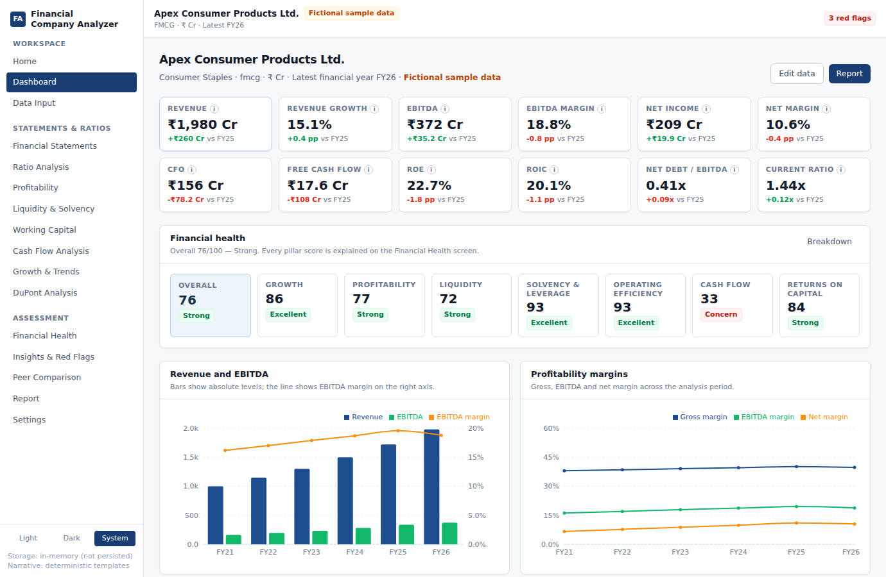
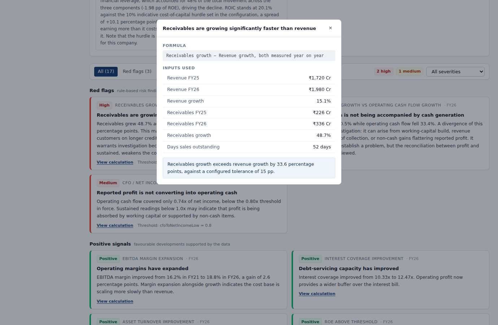
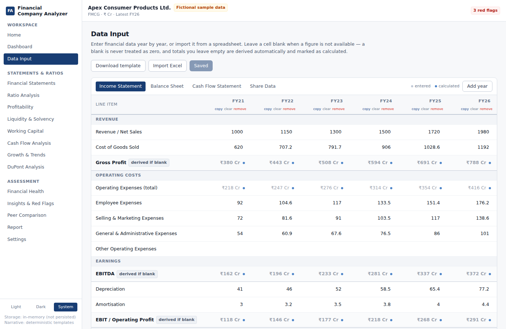
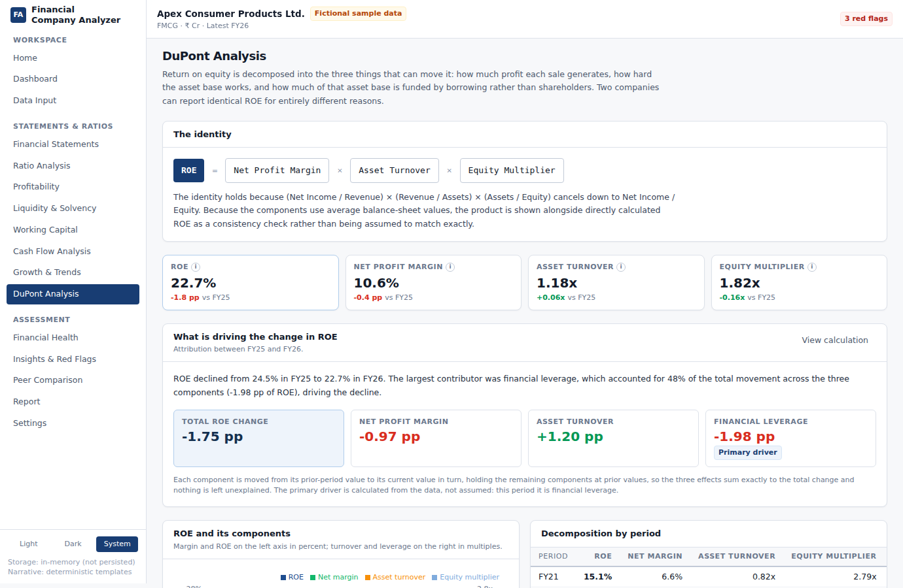
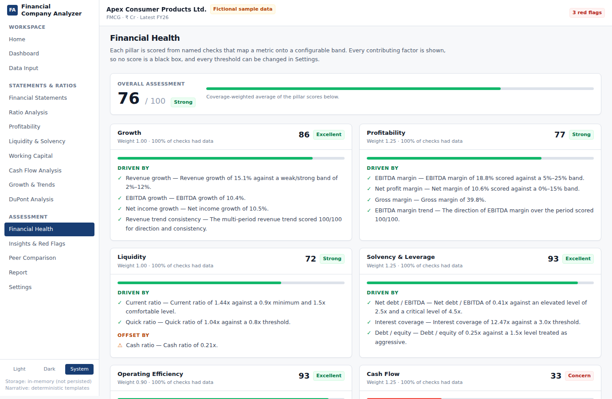
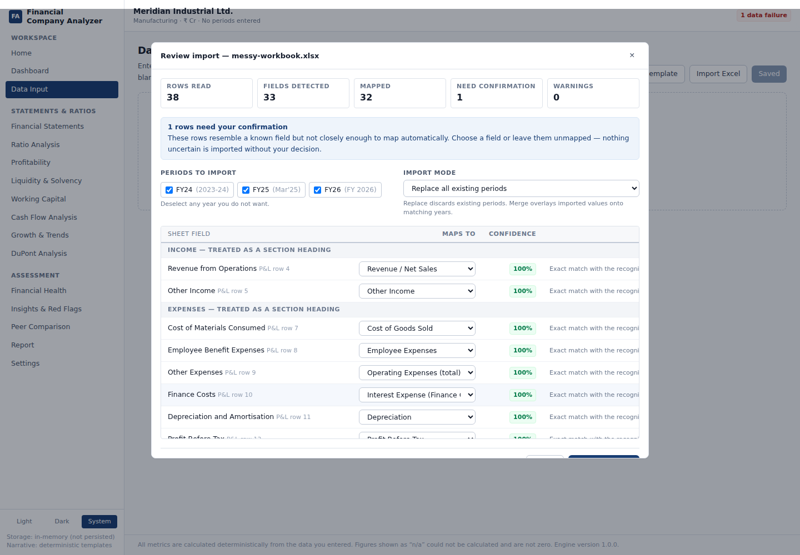

# Financial Company Analyzer

Transform raw company financials into structured financial analysis, trends, ratios, and
actionable insights.

The application takes a company's financial statements — typed into a spreadsheet-style grid or
imported from an Excel file — validates and normalizes them, calculates the full set of financial
metrics, applies a rule-based risk engine, and produces written analyst-style insights, an
executive summary and an exportable report.



---

## The principle the whole system is built on

Three layers are kept strictly separate and are never mixed:

| Layer | What it is | Where it lives |
|---|---|---|
| **Raw data** | Numbers you entered or imported, stored exactly as supplied | `FinancialPeriod.values`, marked `entered` |
| **Calculated data** | Everything the engine derived, each carrying its formula, inputs, period and status | `MetricValue`, and derived line items marked `calculated` |
| **Interpretation** | Flags, insights and the executive summary | `Flag`, `Insight`, `ExecutiveSummary`, each with its `Evidence` |

Every statement the application makes is traceable to the numbers underneath it. Click
**View calculation** on any finding and you get the formula, the exact inputs used, and the
conclusion drawn:

> **Receivables are growing significantly faster than revenue**
> Receivables grew 48.7% against revenue growth of 15.1%, a gap of 33.6 percentage points.
>
> *View calculation →*
> Revenue FY25 ₹1,720 Cr · Revenue FY26 ₹1,980 Cr · Revenue growth 15.1%
> Receivables FY25 ₹226 Cr · Receivables FY26 ₹336 Cr · Receivables growth 48.7%
> Days sales outstanding 52 days
> *Receivables growth exceeds revenue growth by 33.6 percentage points, against a configured
> tolerance of 15 pp.*



The rules that follow from this are enforced throughout:

- A missing value is **never** treated as zero. It is `null`, it renders as `n/a`, and the metric
  that needed it reports why it could not be calculated.
- Nothing divides by zero. `safeDiv` returns `null` rather than `Infinity`.
- No ratio is reported without sufficient data. Growth is not computed off a zero or negative
  base, because the result would not be interpretable.
- No financial conclusion is drawn that the data does not support. Where a relationship is
  suggestive rather than established, the wording says *may indicate*, *could suggest* or
  *warrants investigation*.
- No threshold is hard-coded as a fact. Every one is configurable, industry-aware, and printed
  on the finding that used it.

---

## Quick start

```bash
git clone <this repository>
cd financial-company-analyzer

npm install
cp .env.example .env      # works as-is; see "Environment variables" below

npm run dev               # API on :4000, web app on :5173
```

Open <http://localhost:5173> and click **Load sample dataset** to explore every feature against
the fictional Apex Consumer Products Ltd. five-year financials.

No database is required to run the application. Without a `MONGODB_URI` it stores analyses in
memory and tells you so in the sidebar; everything else behaves identically.

### Other commands

```bash
npm test              # 149 unit tests across the engine, import/export, persistence and upload safety
npm run test:watch
npm run build         # build engine, API and client for production
npm run start         # serve the built API
npm run typecheck     # typecheck all three workspaces
npm run dev:server    # API only
npm run dev:client    # web app only
```

### Requirements

Node.js 20 or later. MongoDB is optional.

---

## The screens

Sixteen sections behind a sidebar: Home, Dashboard, Data Input, Financial Statements, Ratio
Analysis, Profitability, Liquidity & Solvency, Working Capital, Cash Flow, Growth & Trends,
DuPont, Financial Health, Insights & Red Flags, Peer Comparison, Report and Settings.

**Data Input** — a spreadsheet-style grid with add, remove, rename, copy and clear per year.
Totals you leave blank are derived and shown greyed with a provenance dot, so you can see what
the engine worked out without losing the ability to override it.



**DuPont** — the identity, the decomposition per period, and an attribution of the latest change
to margin, turnover and leverage whose three effects sum exactly to the total move.



**Financial Health** — seven pillars, each showing what drives the score and what offsets it,
with the band every check was measured against.



---

## Architecture

```
financial-company-analyzer/
├── packages/core/          @fca/core — the financial engine. No framework, no I/O.
│   ├── src/engine/         line items, normalization, metrics, rules, health, insights
│   ├── src/excel/          cell parsing and fuzzy field mapping
│   ├── src/sample/         the fictional Apex Consumer Products dataset
│   └── test/               88 tests
├── server/                 @fca/server — Express API
│   ├── src/models/         Mongoose schemas
│   ├── src/routes/         companies, analysis, import, export, metadata
│   ├── src/services/       repository, Excel import/template/export, report
│   └── test/               61 tests
└── client/                 @fca/client — React + Vite web app
    ├── src/pages/          the 16 screens
    ├── src/components/     UI primitives, charts, analysis views
    └── src/state/          workspace context
```

The calculation engine is a standalone workspace package with no dependency on React, Express or
MongoDB. **No financial formula exists anywhere else.** The API validates and persists; the client
renders. Both import `@fca/core`, so a number displayed on screen, written into an Excel export
and printed in the PDF report is produced by the same function and cannot disagree.

### The pipeline

```
raw data
   ↓  normalizePeriods()      derive totals, record provenance, never overwrite entered values
   ↓  calculateMetrics()      ~64 metrics per period, each with formula, inputs and status
   ↓  runRules()              17 risk rules + 13 positive-signal rules, threshold-driven
   ↓  buildInsights()         analyst-style narrative from calculated facts only
   ↓  buildExecutiveSummary() prioritised, not exhaustive
       ↓  (optional) LLM      rephrases facts it is given; never computes
```

---

## Environment variables

Copy `.env.example` to `.env`. Every variable is optional except where noted.

| Variable | Default | Purpose |
|---|---|---|
| `NODE_ENV` | `development` | `development`, `test` or `production`. Stack traces are suppressed in production. |
| `PORT` | `4000` | API port. |
| `CORS_ORIGIN` | `http://localhost:5173,http://127.0.0.1:5173` | Comma-separated origins allowed to call the API. Only relevant when the client is served from a different origin. |
| `MONGODB_URI` | *(unset)* | MongoDB connection string. **Leave unset to run in memory** — fully functional, but data does not survive a restart. |
| `MAX_UPLOAD_BYTES` | `10485760` | Maximum accepted spreadsheet size (10 MB). |
| `RATE_LIMIT_WINDOW_MS` | `900000` | Rate-limit window. |
| `RATE_LIMIT_MAX` | `300` | Requests allowed per window. |
| `API_PROXY_TARGET` | `http://localhost:$PORT` | Where the Vite dev server forwards `/api`. Read at build time only; **does not reach the browser bundle**. |
| `VITE_API_BASE_URL` | *(unset)* | Only needed when the API is on a different origin from the client. By default the client calls `/api` on its own origin. |
| `LLM_API_KEY` | *(unset)* | Optional. See below. |
| `LLM_MODEL` | `claude-opus-5` | Model used if an LLM is configured. |
| `LLM_BASE_URL` | Anthropic messages endpoint | Override for a proxy or compatible endpoint. |

**Secrets never reach the browser.** Only `VITE_`-prefixed variables are compiled into the client
bundle, and none of those is a secret — `VITE_API_BASE_URL` is a public URL. `LLM_API_KEY` is read
by the server process alone.

---

## Optional LLM layer

The analysis does not depend on a language model and the application is fully functional with no
API key configured — it uses deterministic insight templates, which is what produced every piece
of narrative in the screenshots.

Where an LLM is configured, the architecture is strictly:

```
raw data → deterministic engine → calculated metrics → rule-based flags → LLM → natural language
```

The LLM receives `buildLlmFacts(result)`: calculated metrics with their formulas, rule outcomes,
health scores and data-quality findings, plus an explicit instruction not to compute new figures
or assert causality the evidence does not establish. It never sees raw unvalidated input, and it
is never responsible for a number. This is what prevents hallucinated financial figures.

Inspect exactly what would be sent:

```bash
curl localhost:4000/api/companies/<id>/facts
```

---

## Excel import

Download the six-sheet template from the Home screen (Company Information, Income Statement,
Balance Sheet, Cash Flow Statement, Share Data, Segment Data). Filling it in means every row maps
at 100% confidence.

**You do not have to use the template.** The importer accepts any workbook and handles:

- Period headers as `FY24`, `FY2024`, `FY 2023-24`, `2023-24`, `2024`, `Mar-24`, `Mar'26`,
  `31 March 2024`, or real Excel dates — normalised to consistent `FYxx` labels
- Indian (`1,23,456`) and Western (`123,456`) digit grouping
- Currency symbols `₹ $ € £ ¥`, and `Rs.`
- Parentheses and trailing minus for negatives: `(1,234)`, `1,234-`
- Percentages, magnitude suffixes (`Cr`, `Lakh`, `Mn`, `Bn`, `k`) with conversion into the
  workbook's declared units
- Blanks, `-`, `—`, `N/A`, `nil`, `#DIV/0!` — all read as *not available*, never as zero
- Any column or row order, extra columns, duplicate fields, missing years, section banners

Terminology is matched against a synonym dictionary, so `Net Sales`, `Turnover`, `Revenue from
Operations` and `Total Income` all resolve to Revenue. Then the **review screen** shows you:




```
Sheet field                    Maps to              Confidence   Why
Revenue from Operations   →    Revenue                  100%     Exact match with "revenue from operations"
Cost of Materials Consumed →   Cost of Goods Sold       100%     Exact match with "cost of materials consumed"
Some unrecognised line     →   — do not import —          60%     Needs your confirmation
```

Nothing below the confidence bar is imported without your decision, and two rows can never map
onto the same field silently. Sign conventions that look inverted (capex reported as negative)
are normalised **with a warning that says so**, not quietly.

---

## Exports

| Format | Contents |
|---|---|
| **PDF report** | 14 sections: overview, executive summary, statements, growth, profitability, liquidity, solvency, working capital, cash flow, DuPont, red flags, insights, overall assessment, data quality. Opens print-formatted; use the browser's *Save as PDF*. |
| **Excel** | Statements with every value marked Entered or Calculated, all metrics with formulas and trends, CAGRs, the written analysis, data-quality register, peer comparison. |
| **CSV** | Financial data and calculated metrics. Unavailable figures are left blank, never written as zero. Formula injection is neutralised on export. |

The report is produced as print-ready HTML rather than a binary PDF: the browser's own print
engine renders fonts and tables correctly on every platform, the output stays selectable and
searchable, and the server ships no headless browser.

---

## Documentation

- **[docs/FORMULAS.md](docs/FORMULAS.md)** — every formula, its inputs, and the methodology
  decisions behind it (average vs closing balances, when a ratio is suppressed, and why)
- **[docs/EXTENDING.md](docs/EXTENDING.md)** — adding a ratio, a line item, a red-flag rule, or an
  industry threshold profile
- **[docs/API.md](docs/API.md)** — HTTP endpoint reference

---

## Sample data

**Apex Consumer Products Ltd. is fictional.** It does not exist and the figures do not describe
any real business. The dataset was generated from a consistent financial model, so the balance
sheet balances exactly in all six years and the cash flow statement reconciles with the movement
in balance-sheet cash.

It is built to exercise the whole application: margin expansion, progressive deleveraging, growing
free cash flow, and a deliberate stretch in FY26 receivables that the risk engine detects. It is
labelled as sample data in the interface, on every export and in the PDF report.

---

## Testing

```bash
npm test
```

149 tests. The financial expectations are hand-calculated, not snapshots of the engine's own
output, so a regression in a formula fails the test rather than silently rewriting the expectation.

Covered: growth and CAGR, all margins, ROA/ROE/ROIC/ROCE, current/quick/cash ratios, debt/equity,
net debt/EBITDA, interest coverage, DSO/DIO/DPO/CCC, FCF, CFO/net income, the DuPont identity and
its attribution, the balance-sheet check and cash-flow reconciliation, and the persistence mapping
where a saved analysis could silently lose line items.

And the cases that matter more: missing data, zero denominators, negative values, negative equity,
one-year datasets, partial statements, industry suppression, unreadable spreadsheet cells,
ambiguous field mappings, export escaping, and the upload guard that reverts and rejects a
workbook which tries to modify built-in prototypes, and the allowlists that must not admit
inherited property names.

---

## Security

- Every request body is validated server-side with Zod; client-side validation is for usability
  only and is not trusted
- Uploads are held in memory and never written to disk, restricted by extension, MIME type and
  size, with formula and HTML evaluation disabled in the spreadsheet parser
- Helmet, a CORS allow-list and rate limiting on all routes
- Company-supplied text is escaped in the generated report
- CSV exports neutralise leading `= + - @` so a crafted company name cannot execute on open
- Field mappings confirmed during an Excel import are re-checked against the canonical line-item
  registry server-side, so the import route is not a way around the allowlist the manual-input
  route enforces
- Allowlist membership is always tested through a `Set`, never with `map[key]` or `key in map`.
  Those consult the prototype chain, so `constructor`, `toString` and `__proto__` pass them and
  the allowlist is defeated — this was a real bug found in review and is covered by tests
- No API key is exposed to the frontend

### Known supply-chain issue: the spreadsheet parser

`xlsx` is pinned at **0.18.5**, which is the last version SheetJS published to npm — they now
distribute only from their own CDN, so `npm install xlsx@latest` still resolves to 0.18.5. That
line carries a prototype-pollution issue reachable by parsing a crafted workbook
([CVE-2023-30533](https://nvd.nist.gov/vuln/detail/CVE-2023-30533), fixed in 0.19.3).

Since this application parses untrusted uploads, that path is reachable, so two things are in
place:

1. **Move to the patched build** if your network allows it. This is the real fix:

   ```bash
   npm install --workspace @fca/server https://cdn.sheetjs.com/xlsx-0.20.3/xlsx-0.20.3.tgz
   ```

   It was not done here because the build environment's egress policy blocks `cdn.sheetjs.com`.

2. **Until then, the parse is bounded at runtime.** `server/src/services/parseGuard.ts` snapshots
   the built-in prototypes, runs the parse, and if anything was grafted onto them it removes the
   additions and rejects the upload with a 400. Pollution cannot outlive the request that caused
   it or reach another user's analysis. This is containment, not a substitute for the upgrade —
   see `server/test/parseGuard.test.ts`, which verifies both the revert and the rejection.

---

## Known limitations

- Peer data is entered manually; there is no market-data feed
- Segment data is read from the template and preserved, but is not yet used by the analysis engine
- Industry configuration adjusts thresholds and suppresses metrics that do not apply. The first
  industry-specific release includes capital intensity (PPE / revenue) for manufacturing,
  automobile, infrastructure, energy, and telecom companies.
- Quarterly and half-yearly data remains visible as entered. Enable **Annualize interim metrics**
  in Settings to annualize growth, CAGR, and flow-based days metrics (4x for quarterly, 2x for
  half-yearly); annual data is unchanged.
- Scenario analysis runs temporary what-if changes against a stored company without persisting
  them, and reports metric, health-score, and red-flag differences.
- There is no authentication; the application is intended to run locally or behind your own
  access control
- The MongoDB path is covered by unit tests of the document mapping, but the live driver round
  trip has not been exercised — MongoDB was not available in the environment this was built in.
  The in-memory path is verified end to end.
